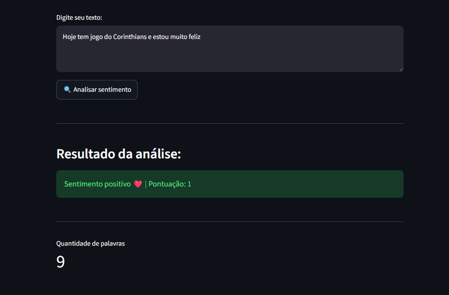
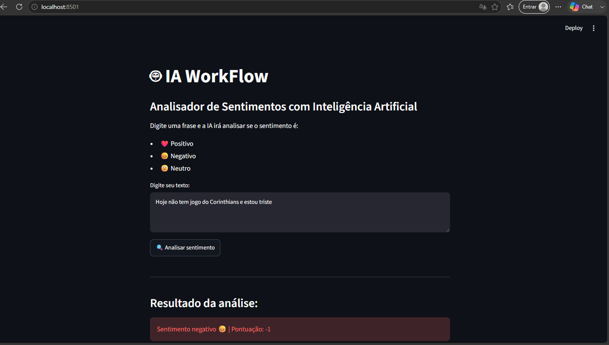
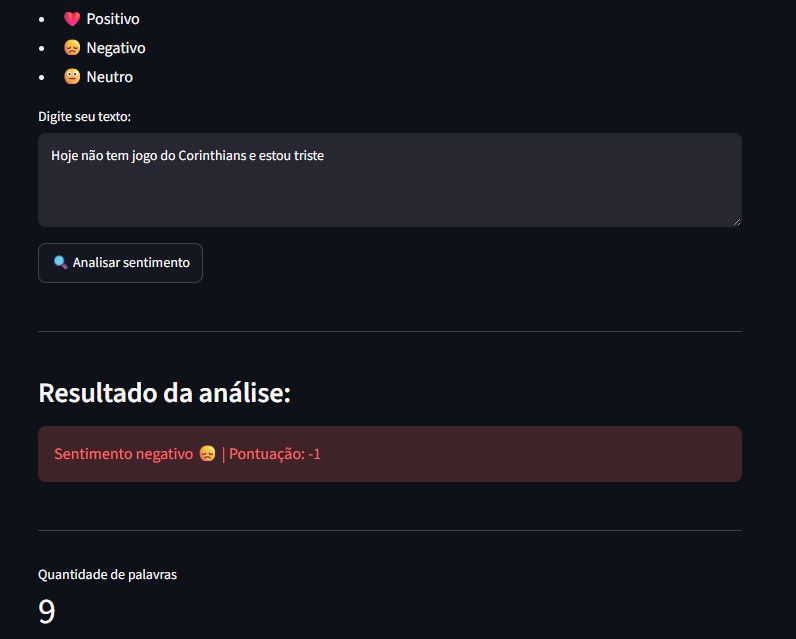
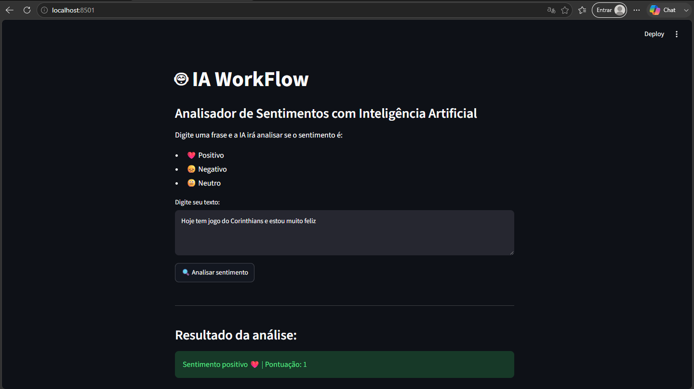

# 🤖 IA Workflow - Analisador de Sentimentos

## 📌 Sobre o projeto

Este projeto apresenta uma aplicação prática de Inteligência Artificial utilizando Python para realizar uma análise simples de sentimentos em textos.

O sistema recebe uma frase digitada pelo usuário e classifica o sentimento como:

- ❤️ Positivo
- 😞 Negativo
- 😐 Neutro

O projeto foi desenvolvido como estudo de caso com o objetivo de aplicar conceitos de desenvolvimento moderno de software, utilizando testes automatizados, GitHub, GitHub Actions, GitHub Copilot e uma interface gráfica construída com Streamlit.

---

# 🎯 Objetivo

Desenvolver uma aplicação simples capaz de:

- Receber um texto informado pelo usuário;
- Identificar palavras relacionadas a sentimentos positivos e negativos;
- Classificar automaticamente o sentimento da mensagem;
- Exibir o resultado por meio de uma interface web intuitiva;
- Aplicar boas práticas de desenvolvimento utilizando testes automatizados e Integração Contínua (CI).

---

# 🛠️ Tecnologias utilizadas

- Python 3
- Streamlit
- Pytest
- Git
- GitHub
- GitHub Actions
- GitHub Copilot
- Ambiente Virtual (venv)

---

# 📂 Estrutura do projeto

```text
IA-WorkFlow-GitHub
│
├── app.py
├── src
│   └── ai
│       ├── analyzer.py
│       ├── palavras.py
│       └── main.py
│
├── tests
│   └── test_analyzer.py
│
├── exemplos
│   ├── tela_streamlit.1.png
│   ├── tela_streamlit.2.png
│   ├── tela_streamlit.3.png
│   └── tela_streamlit123.png
│
├── pytest.ini
├── requirements.txt
├── pyproject.toml
└── README.md
```

---

# ⚙️ Como executar o projeto

### 1. Clonar o repositório

```bash
git clone https://github.com/pedroteatro1/IA-WorkFlow-GitHub.git
```

### 2. Acessar a pasta do projeto

```bash
cd IA-WorkFlow-GitHub
```

### 3. Criar o ambiente virtual

```bash
python -m venv .venv
```

### 4. Ativar o ambiente virtual

Windows:

```bash
.venv\Scripts\activate
```

### 5. Instalar as dependências

```bash
pip install -r requirements.txt
```

### 6. Executar a aplicação

```bash
streamlit run app.py
```

---

# 🧪 Testes Automatizados

O projeto utiliza o framework **Pytest** para validar o funcionamento da aplicação.

Para executar os testes:

```bash
pytest
```

Resultado esperado:

```text
==========================
3 passed
==========================
```

Os testes verificam:

- Identificação de sentimento positivo;
- Identificação de sentimento negativo;
- Identificação de sentimento neutro.

---

# 🚀 GitHub Actions

O projeto utiliza **GitHub Actions** para automatizar a execução dos testes.

Sempre que um novo código é enviado ao repositório, o workflow executa automaticamente os testes utilizando o Pytest.

Essa prática faz parte do processo de **Integração Contínua (Continuous Integration - CI)**, permitindo identificar erros rapidamente e aumentando a qualidade do software.

---

# 🖥️ Interface da aplicação

A interface foi desenvolvida utilizando **Streamlit**, permitindo que o usuário realize a análise de sentimentos de forma simples e intuitiva.

---

# 📷 Demonstração

## Interface Streamlit

> **Importante:** Ajuste os nomes das imagens conforme os arquivos existentes na pasta `exemplos`.

```text
exemplos/
├── tela_streamlit.1.png
├── tela_streamlit.2.png
├── tela_streamlit.3.png
└── tela_streamlit123.png
```

```md







```

---

# 📚 Parte Teórica

## Contexto do desafio

A empresa fictícia enfrentava dificuldades para analisar rapidamente o sentimento presente nas mensagens enviadas por seus clientes. A análise manual demandava tempo, dificultava a tomada de decisões e comprometia a agilidade no atendimento.

Como solução, foi desenvolvida uma aplicação em Python capaz de identificar palavras positivas e negativas em um texto, classificando automaticamente o sentimento como **positivo**, **negativo** ou **neutro**.

Além da implementação da aplicação, o projeto utilizou boas práticas de engenharia de software, incluindo controle de versão com Git e GitHub, testes automatizados com Pytest, integração contínua com GitHub Actions e uma interface gráfica construída com Streamlit.

---

## O papel da Inteligência Artificial no desenvolvimento de software

A Inteligência Artificial tem transformado significativamente o desenvolvimento de software, oferecendo ferramentas que auxiliam programadores durante a escrita do código, na criação de testes e na automação de processos.

Neste projeto, o **GitHub Copilot** foi utilizado como ferramenta de apoio durante o desenvolvimento, sugerindo trechos de código, auxiliando na implementação de funções e contribuindo para maior produtividade.

Além disso, o **GitHub Actions** foi utilizado para automatizar a execução dos testes sempre que alterações são enviadas ao repositório. Essa prática faz parte da Integração Contínua (CI), reduzindo erros e aumentando a confiabilidade do software.

Essas tecnologias demonstram como a Inteligência Artificial e a automação contribuem para tornar o desenvolvimento mais rápido, seguro e eficiente.

---

## Caso real

Um exemplo real é o próprio **GitHub**, que divulgou pesquisas mostrando que desenvolvedores que utilizam o GitHub Copilot conseguem concluir tarefas de programação mais rapidamente e relatam maior satisfação durante o desenvolvimento.

Da mesma forma, milhares de empresas utilizam o GitHub Actions para automatizar testes, integração contínua (CI) e implantação contínua (CD), reduzindo falhas humanas e aumentando a qualidade das aplicações.

Esses resultados demonstram como a Inteligência Artificial e a automação vêm transformando o desenvolvimento moderno de software.

---

# 📖 Referências

- GitHub. **GitHub Copilot**. Disponível em: https://github.com/features/copilot

- GitHub. **GitHub Actions**. Disponível em: https://github.com/features/actions

- GitHub Blog. **Research: Quantifying GitHub Copilot's impact on developer productivity and happiness**. Disponível em: https://github.blog/news-insights/research/research-quantifying-github-copilots-impact-on-developer-productivity-and-happiness/

---

# 👨‍💻 Autor

**Pedro Henrique Araujo Silva**

Projeto desenvolvido como estudo de caso para a disciplina, aplicando conceitos de Inteligência Artificial, Python, testes automatizados, GitHub Actions e GitHub Copilot.